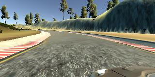

# Behavioral Cloning Project


The goals / steps of this project are the following:

* Use the simulator to collect data of good driving behavior
* Build, a convolution neural network in Keras that predicts steering angles from images
* Train and validate the model with a training and validation set
* Test that the model successfully drives around track one without leaving the road
* Summarize the results with a written report


## Rubric points

### 1. Submission
Project files included:

* __model.py__ containing the script to create and train the model.  Since this already been run, the script will generate model.h5 with the number of epochs already been selected.
* __drive.py__ contains the code to drive the car in autonomous mode in the simulator. This version of the file uses a target speed of 9 mph.  In my testing, I've adjusted the speeds up to 30 mph.
* __model.h5__ contains the data for the trained network.
* __video.mp4__ is a video file containing a lap around Track 1.
* __writeup_report.md__ is this file (containing the project writeup).

Other files are included (such as the iPython notebook), but are intended as a way of keeping all the files together for storage/tracking.


### 2. Model/code submission

The code for building the model (using Keras) is included in model.py.  In addition to building the model, it also includes the code for:

* loading the data
* splitting the data into validation/training sets
* training the model
* generating the final model.h5 file

The code to do the exploratory training (for the hyperparmeters) is included in the iPython notebook.

### 3. Model Architecture

The Model is based on the NVidia PilotNet autonomous driving model.  The code is pretty straightforward and is copied here.

The model uses a total of five convolution layers with four fully connected layers. The first three convolutions use 5x5 kernels with a 2x2 stride and ReLU.  The next two convolution layers use 3x3 kernels with no strides (1x1 stride) and ReLU.

After the convolutions, we flatten the layers.  At this point, Dropout has been added.  After this, we then run through the four fully-connected layers for the final output.


```python
    model = Sequential()

    # Incoming images are : 160x320x3
    # Crop 60 pixels off the top and 20 pixels off the bottom
    model.add(Cropping2D(cropping=((60,20), (0,0)), input_shape=(160,320,3)))

    # Normalize the image
    # scale the image to (-1,+1)
    model.add(Lambda(lambda x: (x/128.0) - 1.0, input_shape=(80,320,3)))

    # There are three convolutional layers
    # with a 5x5 kernel and a stride of 2x2
    # all with relu
    model.add(Convolution2D(24, 5, 5, subsample=(2,2), activation='relu'))
    model.add(Convolution2D(36, 5, 5, subsample=(2,2), activation='relu'))
    model.add(Convolution2D(48, 5, 5, subsample=(2,2), activation='relu'))

    # Then there are two convolution layers
    # with a 3x3 kernel and no striding
    model.add(Convolution2D(64, 3, 3, activation='relu'))
    model.add(Convolution2D(64, 3, 3, activation='relu'))

    model.add(Flatten())

    model.add(Dropout(0.5))

    # Final fully-connected layers
    model.add(Dense(100))
    model.add(Dense(50))
    model.add(Dense(10))
    model.add(Dense(1))

    model.compile(loss='mse', optimizer='adam')
```

#### Changes to the NVidia model

* The images are cropped from 160x320x3 to 80x320x3. This has been done by taking 60 pixels off of the top of the image and 20 pixels off of the bottom of the image.  Since those parts of the image are, in a sense, beyond the horizon, they do not help with the training of the model.  Also they may mislead the model since they would specialize the model for this particular track.
* In addition, the individual pixel values are normalized to (-1, +1) instead of [0, 255].
* Finally, a dropout layer is added between the last convolutional layer and the first fully-connected (Dense) layer.
* The Adam optimizer is used with Mean-Squared Error ("mse").

### 4. Overfitting

To address overfitting:

* A Dropout layer was added
* Additional data were generated from the original images (images were flipped and the left/right images were also used).
* The number of epochs was chosen by looking at the training/validation error from an exploratory run (see the iPython notebook).

### 5. Training data/process

The first pass at the data was a 3-lap run around Track 1 (in the counter-clockwise direction).  Before the actual recording, I practiced going around the track to ensure that I stayed in the center.  I used the keyboard for steering, which may become visible at times, due to the large jumps in the steering angle when taking turns.

After the first pass, I then flipped the images to increase the amount of data.

This seemed to work ok.  It also worked ok when I ran the track in the reverse direction. But I did notice that the car seemed to jerk between the left and right, even at 9mph. Running the model at 20mph, showed the car violently moving from left to right on the straight/slightly curving portions.  It was interesting that the curves were ok!

So I decided to gather more data, and then ran the track in the opposite direction (also adding the left/right images to the dataset).  This helped to smooth out the behavior but the car would still start oscillating at 30mph.

I tried to modify the amount of the steering correction for the left/right images.  At a +-0.2 correction, it stabilized the car on the straights/slight curves, but the car wouldn't react in time at the tighter curves at 30mph.  At +-0.3, it corrected for the curves but would the car would oscillate at higher speeds.

As a final point of data, I added a dataset where I steered into the curves and recorded the recovery.  This seemed to help a bit with the curves.  Probably more data and more varied angles would help here.  There were still some problems with the road sections that didn't have well-defined borders.

##### Summary data

* Samples from initial counter-clockwise run: __3,666__
* Samples from clockwise run: __5,008__
* Samples from corrective action run: __783__
* Samples number of points: __9,457__

Each sample generates 3 images: left, right, and center.
Each of these images was then left/right flipped to generate more data.

* Total number of data points: __56,742__ = 6 * (5008+783+9457)
* __20%__ of points were used for validation
* Training set size: __45,393__
* Validation set size: __11,349__

#### Sample images

This is an image of center-of-road driving.


Here is an example of the three images generated for one sample.  The images are shown: left, center, and right.
  


For an example of the flipped images, here's a sample (the left image is the original image, the right image is the flipped image):


Also, this is a sample of the cropped images (to show what the neural network is actually training on).


### 6. How the model was built

The model was built from the NVidia PilotNet autonomous driving model.

Most of the model was kept unchanged.  The main differences were:

* Data preprocessing, the images from the simulator are in RGB. OpenCV loads the data to BGR.  So the training data were converted to RGB before training (so that no conversions are required when actually running the model).
* The images are cropped to remove extraneous information.
* A Dropout() layer was added in between the convolution layers and the fully connected layers to reduce overfitting.
* The number of epochs was picked to minimize the Validation loss.

Driving at 9mph actually went pretty well. Driving at higher speeds (20mph or 30mph) would start to show instabilities (the car would begin to oscillate heavily on the slightly curving sections of the road).  Some of this may be artifacts from driving via the keyboard, as the inputs are rather sudden rather than gradual.

#### Hyperparameter selection

* __Number of Epochs__  A longer run of 15 epochs was run to examine the behavior of the training vs. validation loss.  I tried to find the proper point in the curve (after this point the validation loss would oscillate).  A value of 11 epochs was chosen for training.
* __Batch size__ This value was not changed much and was left at 32.
* The Adam optimizer was used so there was not tuning of the learning parameter.


